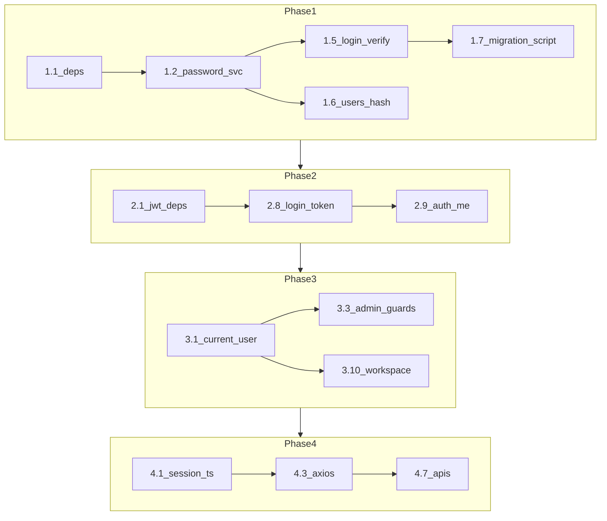

# Auth & Session — Task Breakdown (historical)

> **Completed** for the current MVP. Use [`PRODUCTION_READINESS.md`](PRODUCTION_READINESS.md), [`PRODUCTION_AUTH.md`](PRODUCTION_AUTH.md), and [`PRODUCTION_DEPLOYMENT_CHECKLIST.md`](PRODUCTION_DEPLOYMENT_CHECKLIST.md) for current behaviour.  
> This file is kept as an implementation paper trail only — do not treat unchecked rows as open work.

> Parent plan: `.cursor/plans/auth_and_session_hardening_696ff07a.plan.md`

**Checkpoint after each task:** `cd backend && npm run build` (and portal `npm run build` when touching frontends).

---

## Phase 1 — Password encryption (backend)

| # | Task | Files | Verify |
|---|------|-------|--------|
| 1.1 | Install `bcrypt` + `@types/bcrypt` | `backend/package.json` | `npm install` in backend |
| 1.2 | Create `PasswordService` (`hash`, `verify`, `isBcryptHash`) | `backend/src/modules/auth/password.service.ts` | Unit test or manual `hash('test')` |
| 1.3 | Add lazy rehash helper: plain compare → bcrypt `UPDATE` on login | `password.service.ts` or `auth.service.ts` | — |
| 1.4 | Wire `PasswordService` into `AuthModule`; inject into `AuthService` | `auth.module.ts`, `auth.service.ts` | — |
| 1.5 | Replace plain `===` in `login()` with `verify()` + optional rehash | `auth.service.ts` | `POST /auth/login` with `requestflow` |
| 1.6 | Hash password on `UsersService.create` / `update` | `users.service.ts` | Admin creates user → DB hash starts with `$2` |
| 1.7 | Add `backend/scripts/hash-demo-passwords.ts` + npm script | `package.json`, `scripts/` | Run script; demo emails login |
| 1.8 | Update `002_seed_core_data.sql` with bcrypt hashes (fresh installs) | `database/002_*.sql` | New DB seed → login works |
| 1.9 | Unit tests: `password.service.spec.ts`, login wrong password | `src/**/*.spec.ts` | `npm test` |

---

## Phase 2 — JWT + global guard (backend)

| # | Task | Files | Verify |
|---|------|-------|--------|
| 2.1 | Install JWT/passport packages | `backend/package.json` | `npm install` |
| 2.2 | Add `JWT_EXPIRES_IN` to `.env.example` | `backend/.env.example` | — |
| 2.3 | Create `@Public()` decorator + `IS_PUBLIC_KEY` metadata | `common/decorators/public.decorator.ts` | — |
| 2.4 | Create `JwtStrategy` (Bearer, validate active user) | `auth/jwt.strategy.ts` | — |
| 2.5 | Create `JwtAuthGuard` extending `AuthGuard('jwt')` + public skip | `auth/jwt-auth.guard.ts` | — |
| 2.6 | Register `JwtModule`, strategy, guard as `APP_GUARD` | `auth.module.ts`, `app.module.ts` | — |
| 2.7 | Mark `@Public()` on `POST /auth/login` and `GET /health` | `auth.controller.ts`, `health.controller.ts` | Unauthenticated login still works |
| 2.8 | `login()` returns `{ user, accessToken, expiresIn }` | `auth.service.ts`, `auth.controller.ts` | Response includes token |
| 2.9 | Add `GET /auth/me` (protected) | `auth.controller.ts`, `auth.service.ts` | Bearer → user profile |
| 2.10 | E2E: login + `/auth/me`; no token → 401 on `/workspace` | `test/app.e2e-spec.ts` | `npm run test:e2e` |

**Note:** Until Phase 3, frontends can still use query `userId` if guard allows all routes temporarily — prefer completing 2.7–2.10 then 3.x before frontend Bearer work.

---

## Phase 3 — API authorization (backend)

### 3A — Shared primitives

| # | Task | Files | Verify |
|---|------|-------|--------|
| 3.1 | `CurrentUser` decorator + `JwtPayload` type | `common/decorators/current-user.decorator.ts` | — |
| 3.2 | `AdminRoleGuard` (`Admin`, `System Admin`) | `common/guards/admin-role.guard.ts` | — |

### 3B — Admin controllers (one task each)

| # | Task | Files | Verify |
|---|------|-------|--------|
| 3.3 | `@UseGuards(AdminRoleGuard)` on admin dashboard/reports/activity | `admin.controller.ts` | Employee JWT → 403 |
| 3.4 | Same on users CRUD | `users.controller.ts` | — |
| 3.5 | Same on departments | `departments.controller.ts` | — |
| 3.6 | Same on request-templates | `request-templates.controller.ts` | — |
| 3.7 | Same on system-settings | `system-settings.controller.ts` | — |
| 3.8 | Same on roles | `roles.controller.ts` | — |
| 3.9 | Protect `GET /users/by-email/:email` (admin only or remove) | `users.controller.ts` | — |

### 3C — User-scoped controllers (one task each)

| # | Task | Files | Verify |
|---|------|-------|--------|
| 3.10 | Workspace: `userId` from `@CurrentUser()`, drop query param | `workspace.controller.ts`, `workspace.service.ts` | — |
| 3.11 | Notifications: all endpoints use JWT `sub` | `notifications.controller.ts` | — |
| 3.12 | Assignments list: JWT `sub`; drop `userId` query | `assignments.controller.ts`, query service | — |
| 3.13 | Assignments mutations: `actorUserId` from JWT | `assignments.controller.ts`, mutation service | — |
| 3.14 | Requests list “mine”: `createdByUserId` from JWT | `requests.controller.ts`, query service | — |
| 3.15 | Requests inbox: keep `targetDepartmentName` + manager dept check in service | `requests-query.service.ts` | Manager only |
| 3.16 | Requests create: set `createdByUserId` from JWT | `requests.controller.ts`, create service, DTO | — |
| 3.17 | Requests status + provide-info: actor from JWT | `requests.controller.ts`, lifecycle service | — |
| 3.18 | Assignment create: validate assigner is dept manager | `assignments-mutation.service.ts` | — |
| 3.19 | Request approve/reopen: validate requester + status | `requests-lifecycle.service.ts` | — |
| 3.20 | DTO cleanup: optional/remove client-supplied user ids | `dto/*.ts` | `npm run build` |

### 3D — Phase 3 verification

| # | Task | Verify |
|---|------|--------|
| 3.21 | curl: no token → 401 on `/requests`, `/workspace` | — |
| 3.22 | curl: Jane token cannot pass `createdByUserId=other` (param ignored/rejected) | — |
| 3.23 | curl: Jane token → 403 on `GET /admin/dashboard` | — |

---

## Phase 4 — Frontend session (run 4.x only after Phase 3)

### 4A — User portal foundation

| # | Task | Files | Verify |
|---|------|-------|--------|
| 4.1 | Extend `AppSession` + `getAccessToken`, `isSessionExpired`, `loadSession` expiry | `user-frontend/src/lib/session.ts` | — |
| 4.2 | Add `session-events.ts` (`rf:session-expired`) | `user-frontend/src/lib/session-events.ts` | — |
| 4.3 | Axios request/response interceptors | `user-frontend/src/lib/api.ts` | Network tab shows Bearer |
| 4.4 | `login()` + `fetchCurrentUser()` for new API shape | `user-frontend/src/lib/auth-api.ts` | Login stores token |
| 4.5 | `auth-context`: bootstrap `/auth/me`, 401 listener, logout clears cache | `user-frontend/src/lib/auth-context.tsx` | Hard refresh stays logged in |
| 4.6 | Optional: `storage` event for cross-tab logout | `auth-context.tsx` | — |

### 4B — User portal API clients (one task each)

| # | Task | Files |
|---|------|-------|
| 4.7 | `workspace-api.ts` — remove `userId` param | |
| 4.8 | `notifications-api.ts` — remove `userId` param | |
| 4.9 | `assignments-api.ts` — remove `userId` / `actorUserId` params | |
| 4.10 | `requests-api.ts` — remove `createdByUserId` / `actorUserId` params | |
| 4.11 | Update hooks that pass `state.auth.userId` into APIs (only UI if needed) | `hooks/*`, pages |

### 4C — Admin portal (mirror 4A–4B)

| # | Task | Files |
|---|------|-------|
| 4.12 | `session.ts` + token fields | `admin-frontend/src/lib/session.ts` |
| 4.13 | `session-events.ts` | `admin-frontend/src/lib/session-events.ts` |
| 4.14 | `api.ts` interceptors | `admin-frontend/src/lib/api.ts` |
| 4.15 | `auth-api.ts` login + `/auth/me` | `admin-frontend/src/lib/auth-api.ts` |
| 4.16 | `auth-context.tsx` bootstrap + logout cache | `admin-frontend/src/lib/auth-context.tsx` |
| 4.17 | Smoke: admin login, dashboard, users page | manual |

### 4D — User portal E2E smoke

| # | Task | Verify |
|---|------|--------|
| 4.18 | Login Jane → dashboard counts | :3000 |
| 4.19 | Logout → login; no stale data in lists | |
| 4.20 | Invalid/expired token → redirect login | |

---

## Phase 5 — Docs & final QA

| # | Task | Files |
|---|------|-------|
| 5.1 | Update `backend/database/README.md` (bcrypt script, deprecate 005) | |
| 5.2 | Update `docs/LOCAL_RUN.md` (hash script, re-login note) | |
| 5.3 | Update `AGENTS.md` + `CLAUDE.md` (JWT, Bearer, troubleshooting) | |
| 5.4 | Update `backend/README.md` auth section | |
| 5.5 | Full admin smoke test (6 steps) | |
| 5.6 | Full user E2E table (AGENTS.md) | |

---

## Suggested “sprint” groupings (if you want fewer context switches)

| Sprint | Tasks | ~Time |
|--------|-------|-------|
| **A** | 1.1–1.6 | Backend passwords working |
| **B** | 1.7–1.9, 2.1–2.10 | JWT login + guard |
| **C** | 3.1–3.9 | Admin API locked |
| **D** | 3.10–3.23 | User API identity from JWT |
| **E** | 4.1–4.11 | User frontend |
| **F** | 4.12–4.20, 5.1–5.6 | Admin frontend + docs + QA |

---

## Dependency diagram

